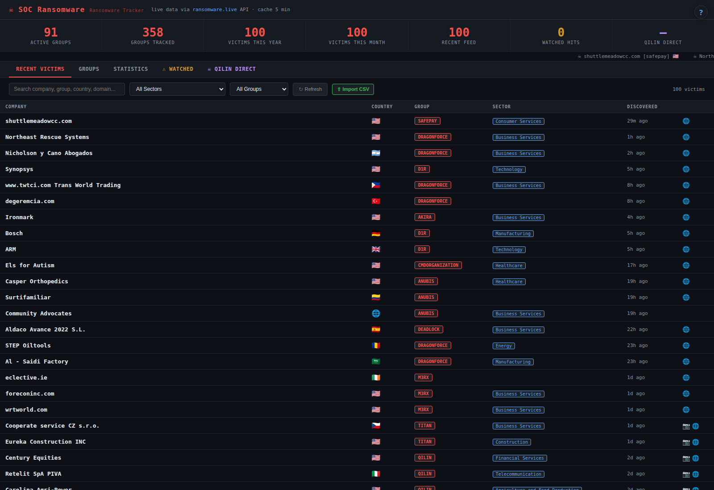

# soc-ransomware

> Ransomware victim/group tracker (ransomware.live mirror)

  

ransomware.live mirror: victims and groups across the ecosystem.

## Documentation

See **[MANUAL.md](MANUAL.md)** for the full manual (overview, configuration, endpoints, integration, troubleshooting). In the running dashboard, click the **`?` Help button** in the top-right corner to open it at `/manual`.
